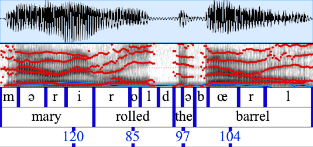

# praatIO

[](https://travis-ci.org/timmahrt/praatIO.js)
[](https://coveralls.io/github/timmahrt/praatIO.js?branch=master)
[](http://opensource.org/licenses/MIT)
[](https://www.npmjs.com/package/praatio)

A library for working with textgrid files in javascript.

Textgrids are containers for audio annotations.  Annotations could include
speech transcripts, phonetic information, noise events (e.g. door slams, laughter), impressionistic ratings, or numerical data (pitch values).

Each annotation layer is known as a tier.  Tiers come in two varieties: point tiers and interval tiers.

Textgrids can be opened and manually edited with praat
http://www.fon.hum.uva.nl/praat/

praatIO.js can read and write textgrid files and has various functions for modifying and querying textgrid files.  Combined with an audio library, one could programmatically extract information or subsegments of an audio file.  

## Major revisions

Ver 2.0 (February 17, 2019)
- Complete rewrite
- New tree-shaking friendly API
- 100% of all praatIO.py main functions have been ported.
- Javadocs
- Tests

Ver 1.0 (December 31, 2018)
- Bugfixes and style refactoring (ES6)
- Passing linter and building


Ver 0.0 (June 06, 2015)
- Support for reading in a longform textgrid as JSON
- Handles both point tiers and interval tiers


## Requirements

None


## Installation

`npm install praatio`


## Usage / Before Getting Started

Although the code is broken across several modules for organization, the whole api is exposed in the main import.  E.g. all functions and classes can be imported like so:

```javascript
import {
  Textgrid, IntervalTier, PointTier, parseTextgrid,
  serializeTextgrid, serializeTextgridToCsv
} from 'praatio'
```

Important for working with praatio is understanding the root classes: Textgrid, IntervalTier, and PointTier.  IntervalTier and PointTier hold time and label information that describe events that occur over an interval or at discreet points in an audio file.  A Textgrid is a container that can hold multiple tiers that contain different information about the same audio file.

For example, as shown in the following schematic, we could annotate one tier with the words spoken in an utterance, annotate another tier with phones (vowels and consonants), and in a third tier, annotate the max pitch value found in each word.



A Textgrid contains two important instance variables: `tierDict` and `tierNameList`.  `tierDict` is an object of the form `{tierName: tier, ...}` that stores the Textgrid's tiers.  Tiers are ordered and `tierNameList` maintains that order.

IntervalTiers and PointTiers are very similar.  Both have only one important instance variable--an Array called `entryList`.  The entryList for intervalTier looks like `[[startTime, stopTime, label], ...]` and the entryList for pointTier looks like `[[time, label]...]`.  Most methods that operate on tiers work on both but some only work one or the other--in such cases, it is clearly indicated in the method name and arguments (compare `takeTierUnion` and `takeIntervalTierDifference`).

**IMPORTANT** When working with Textgrids and tiers, avoid modifying their state directly.  Use the included functions if you need to modify them.

Here is a simple practical example of how to get durations of intervals in an IntervalTier:

```javascript
import {parseTextgrid}
def printOutDurations(tgFileBuffer, tierName) {
  let tg = parseTextgrid(tgFileBuffer);
  let tier = tg.tierDict[tierName];

  for (let i = 0; i < tier.entryList.length; i++) {
    let entry = tier.entryList[i];
    console.log(entry[1] - entry[0]);
  }
}
```

Being able to iterate over a tier is the only thing that is needed from the tier itself.  However, there are lots of methods provided for modifying or querying textgrids and tiers.  These are summarized below and provided in more detail in the documentation.

### Serializing

If you read a .TextGrid file into memory,
`parseTextgrid` can be used to convert that into a Textgrid instance.

To go the opposite direction, use `serializeTextgrid` which
returns the contents of a `.TextGrid` file as a string,
which can be written directly to a file.

`serializeTextgridToCsv` works similarly, but returns the textgrid
as a comma separate list of values.  A textgrid cannot be fully
represented in a csv file, so you'll have to choose the tier
to 'pivot' from.

### Methods

Here is a short summary of the provided functions.  Please see the documentation for details: [praatIO jsdocs page](http://timmahrt.github.io/praatIO.js/)

The main data structures

  * Textgrid, IntervalTier, PointTier

Functions that modify textgrids or tiers

  * appendTextgrid, appendTier, cropTextgrid, cropTier, editTextgridTimestamps, editTierTimestamps,
  eraseRegionFromTextgrid, eraseRegionFromTier,
  insertSpaceIntoTextgrid, insertSpaceIntoTier,
  mergeTextgridTiers,
  takeTierUnion, takeIntervalTierDifference, takeIntervalTierIntersection,

Functions for comparing

  * compareTextgrids, compareTiers, compareEntries,
  comparePoints, compareIntervals

Functions for copying

  * copyTextgrid, copyTier

Functions for querying

  * getValuesAtPoints, getValuesInIntervals, getEntriesInInterval,
  getNonEntriesFromIntervalTier, findLabelInTier

Defined exceptions

  * NonMatchingTiersException, IncorrectArgumentException,
  TierExistsException, TierCreationException, TextgridCollisionException,
  OvershootModificationException, IndexException,

Constants

  * INTERVAL_TIER, POINT_TIER, MIN_INTERVAL_LENGTH

For serializing

  * parseTextgrid, serializeTextgrid, serializeTextgridToCsv, decodeBuffer,

Various utility functions

  * doIntervalsOverlap, isClose, sortCompareEntriesByTime,
  entryListToTree, findIntervalAtTime, findPointAtTime
